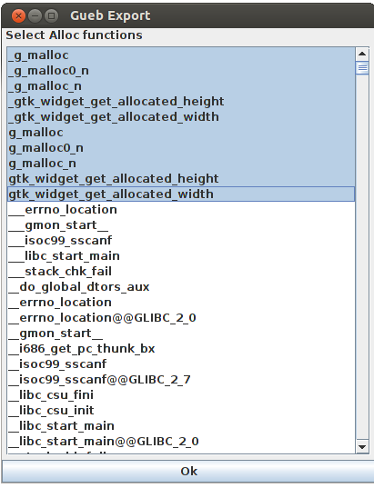
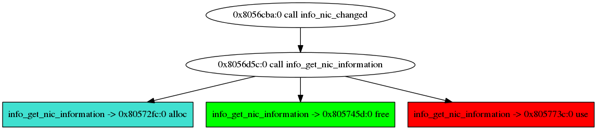
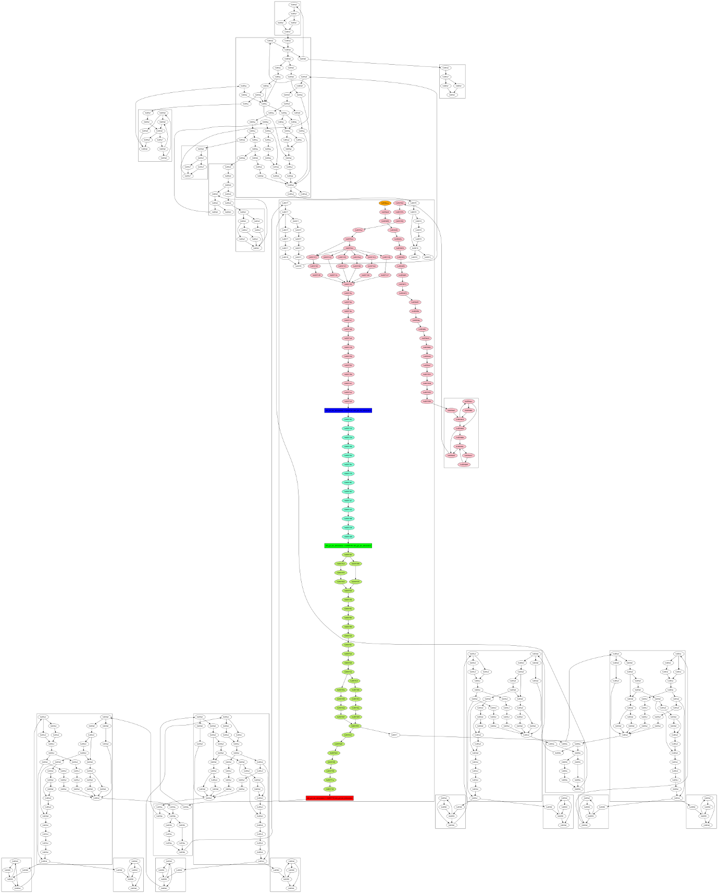
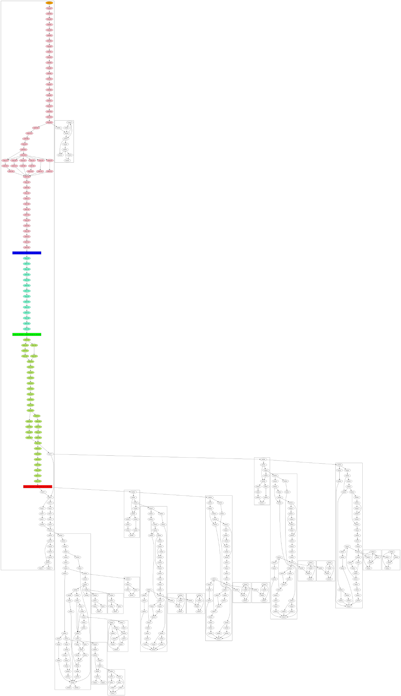

**GUEB** Static analyzer detecting Use-After-Free on binary	
==============

Presentation
--------------

GUEB is a static analyzer that performs use-after-free detection on binary.
The tool is still under development, any commentary / help are welcome.

Basically GUEB performs a value analysis on binary code, tracks pointers and states of the heap. When GUEB detect the use of a freed pointer, it extracts the sub-graph representation of the use-after-free.

If you want to try GUEB easily (and skip the compilation part): [here](http://www-verimag.imag.fr/~feist/GUEB.ova) you will find a virtual machine with everything installed (login/pass: gueb/gueb) (md5 : 53458b32fee721717455902920b3c6f7). 

[How to compile](#how-to-compile)

[How to use](#how-to-use)

[Use Case](#use-case--gnome-nettool)

[Limitations](#limitations)

[Troubleshooting](#troubleshooting)

[Vulnerabilities found](#vulnerabilities-found-by-gueb)

[Author](#author)

[Thanks](#thanks)

## <a name="how-to-compile"></a>How to compile
--------------
GUEB will not work on a 32 bits machine (for now).
GUEB was tested on a Ubuntu 14.04 64 bits.
You need to have ocaml (at least v4.02) installed, if not :
```  
add-apt-repository ppa:avsm/ppa
apt-get update
apt-get install ocaml m4 opam
opam init
eval `opam config env`
```
You also need to have piqi installed :
```
opam update
opam install piqi
```
Then compile the code
```
cd src
export PATH=$PATH:~/.opam/system/bin/ && make
```

Be sure that you have Java 8 installed, if not : (tested on Ubuntu)
```
add-apt-repository ppa:webupd8team/java
apt-get update
apt-get install oracle-java8-installer
```
Note that you have differents version of Java installed in the same time and change with :
```
update-alternatives --config java
```

Finally you need to have [jython](http://www.jython.org/downloads.html) in version 2.7.0. Note that Jython works better installed that with the standalone .jar version.
## <a name="how-to-use"></a>How to use
--------------
GUEB uses REIL as intermediate representation (see [BinNavi](https://github.com/google/binnavi)) :


First you need to extract a REIL representation of the binary from the BinNavi database to a protobuf file.
A jython script is provided in export/gui.py.

You need to modify the first lines of export/export_probotuf.py with the right path of instalation and  your BinNavi database information.


Then run 
```
cd export
jython gui.py
```
Chosse the proper module on the first windows.


The second and the third windows allow you to specify all the wrapper to malloc and free.



Two files will be create, the first one is the protobuf file, the second one is the list of functions with no caller (that you can use as entry points on GUEB).

Then you can launch GUEB :
```
gueb -reil reil_file -funcs-file func_name -output_dir results
```

If a use-after-free is found, results of the analysis will be located in  results/func_name/ (as a dot file)

## <a name="use-case--gnome-nettool"></a>Use Case : Gnome-nettool
-----------
In ./example there are two file : 
* gnome-nettool : the protobuf file of gnome-nettool
* gnome-nettool-entry-points : a text file containing all the entry-points of the analysis (all functions without caller)

You can launch GUEB on all the possible entry point :
```
gueb -reil gnome-nettool -func gnome-nettool-entry-points -output_dir results -type 2
```
-type 2 is used to precise that the analysis will be launch on a set on entry point.

GUEB will detect 5 use-afte-free (4 false positives, 1 true positive).
The real one is located in info_nic_changed :

From this tree, we can suspect that the root of the use-after-free is located in the function info_get_nic_information.
We can export the sub-graph of info_get_nic_information leading to the use-after-free with this command :
```
gueb -reil gnome-nettool -func info_get_nic_information -flow-graph-dot
```
A second dot file will be created :
<a href="./doc/pics/gnome-nettool3.png"></a>
* The node orange is the entry point of the first function
* The blue node is the allocation site
* The green node is the free site
* The red node is the use site
* Others nodes in color represent the sub-graph leading to the use-after-free
* Nodes of the same function are grouped into boxes

You can create a representation that not include arc between ret of functions and the caller with :
```
gueb -reil gnome-nettool -func info_get_nic_information -flow-graph-dot -flow-graph-call-disjoint
```
<a href="./doc/pics/gnome-nettool3.png"></a>
This representation can be easier to understand.


You can find more options with
```
gueb -help
```

## <a name="limitations"></a>Limitations

* Calling convention : for now gueb supports only cdecl
* GUEB is still a prototype, large binary files are out of scope of the analysis 

## <a name="troubleshooting"></a> Troubleshooting

#### piqilib :

Some user reported trouble to build piqilib. During piqi installation, piqilib can be installed in version 0.6.6 with opam. If so please update your piqilib at version 0.6.12 at least.


## <a name="vulnerabilities-found-by-gueb"></a>Vulnerabilities found by GUEB
----------

* Jasper-JPEG-200 (CVE-2015-5221)
* openjpeg (CVE-2015-8871)
* gnome-netool : https://bugzilla.gnome.org/show_bug.cgi?id=753184 
* bind (https://fossies.org/diffs/bind/9.10.2-P4_vs_9.10.3/CHANGES-diff.html ( 4179.  [bug]  Fix double frees in getaddrinfo() in libirs.     [RT #40209] )
* accel-ppp (http://accel-ppp.org/forum/viewtopic.php?f=18&t=581)
* giflib (CVE-2016-3177)

## <a name="author"></a>Author
-------------
Feist Josselin (josselin.feist [SPAM] imag.fr)
 
This tool is a part of my thesis (for more information : http://www-verimag.imag.fr/~feist/)

Team : http://www-verimag.imag.fr/~potet/code-secu-activities.html

## <a name="thanks"></a>Thanks
-------------
Benjamin Farinier (CEA) for these advices in Ocaml.
